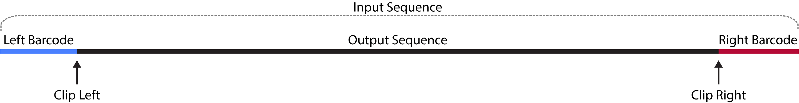
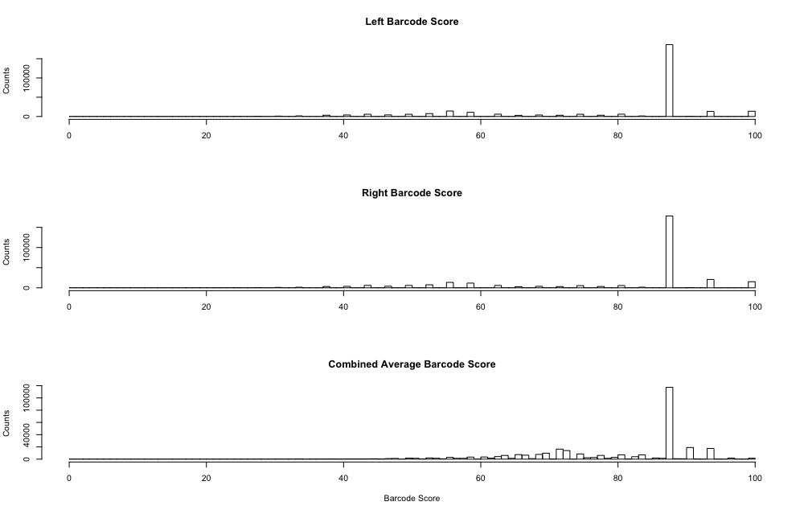

<h1 align="center">
    lima - CCS Barcode Demultiplexer
</h1>

  

## TOC
* [Scope](#scope)
* [Workflow](#workflow)
* [Barcode score](#barcode-score)
* [Defaults](#defaults)
* [FAQ](#faq)
  * [How fast is fast?](#how-fast-is-fast)
  * [Is there a way to show the progress?](#is-there-a-way-to-show-the-progress)
  * [Can I set the number of threads?](#can-i-set-the-number-of-threads)
  * [How can I easily plot the score distributions?](#how-can-i-easily-plot-the-score-distributions)
  * [Can I split my data by barcode?](#can-i-split-my-data-by-barcode)
  * [Why are asymmetric hits reported in --symmetric mode?](#why-are-asymmetric-hits-reported-in---symmetric-mode)
  * [Why are symmetric hits reported in the default asymmetric mode?](#why-are-symmetric-hits-reported-in-the-default-asymmetric-mode)
  * [How do barcode indices correspond to the input sequences?](#how-do-barcode-indices-correspond-to-the-input-sequences)

## Scope
Demultiplexes CCS reads with insane speed, vectorized alignment and parallelized
processing. In- and output are BAM. Barcode sequences get clipped and `bq` and `bc` tags
added, just like bam2bam. Barcodes do not necessarily have to be in the correct
direction. Output can be split by barcode.

## Workflow

*Lima* processes each input sequence individually.
For each input sequence, barcodes are called and clipped separately to produce
the output sequence. For each target barcode, left and right, each of the
provided sequences is aligned as given and as reverse-complement and the best
scoring sequence is chosen. This procedure might be called *asymmetric*.
If only identical barcode pairs are of interest, *symmetric*, please use
`--symmetric`.

## Output
*Lima* generates four output files, all starting with the BAM input file name
prefix.

### BAM
The first file `prefix.demux.bam` contains clipped subreads, annotated with
barcode tags, that passed filters and respects `--symmetric`.

### Report
Second file is `prefix.demux.report`, a tsv file about each read, unfiltered.
Example:

    $ head prefix.demux.report | column -t
    ZMW                                BcLeft  BcRight  ScoreLeft  ScoreRight  MeanScore  ClipLeft  ClipRight
    m54011_170105_093642/30867881/ccs  0       50       84         59          71         14        2223
    m54011_170105_093642/30867884/ccs  36      14       78         100         89         15        2222
    m54011_170105_093642/30867886/ccs  3       36       47         100         73         15        2214
    m54011_170105_093642/30867887/ccs  10      32       100        100         100        15        2217

### Summary
Third file is `prefix.demux.summary`, showing how many reads have been filtered
and how many are *symmetric*/*asymmetric*.
Example:

    Above length and score threshold : 979
    Below length and score threshold : 2
    Below length threshold           : 5
    Below score threshold            : 21

### Counts
Fourth file is `prefix.demux.counts`, a tsv file, shows the counts for each
observed barcode pair; only those barcode that passed filters are counted.
Example:

    $ cat prefix.demux.counts | column -t
    IndexLeft  IndexRight  Counts
    0          0           100
    0          1           56
    1          0           5112
    1          2           846

## Barcode score
The barcode score is normalized between 0 and 100, whereas 0 is no hit and
100 perfect match. The provided score is the mean of both normalizated
barcode scores:

    score = (left_barcode_ssw_score + right_barcode_ssw_score) / (2 * barcode_length * match_score)

## Defaults
 - Reads with length below 50 bp after demultiplexing are omitted.
   Adjusted with `--min-length`
 - Reads with barcode score below 50 are omitted.
   Adjust with `--min-score`
 - For each barcode, we align it to a subsequence of the begin and end of
   the CCS read. The length of the subsequence is `barcode_length * multiplier`,
   which can be adjusted with `--window-size-mult`.
 - Alignment options
    -A,--match-score       Score for a sequence match. [2]
    -B,--mismatch-penalty  Penalty for a mismatch. [2]
    -O,--gap-open-penalty  Gap open penalties for deletions and insertions. [3]
    -e,--gap-ext-penalty   Gap extension penalties for deletions and insertions. [1]

## FAQ
### How fast is fast?
Example: 200 barcodes, asymmetric mode (try each barcode forward and
reverse-complement), 300,000 CCS reads. On my 2014 iMac with 4 cores + HT:

    3242.43s user 28.80s system 668% cpu 8:09.01 total

Those 8:09 minutes translate into 1.63 milliseconds per ZMW,
8.15 microseconds per barcode for both sides aligning forward and reverse-complement,
and 2 microseconds per alignment. This includes IO.

### Is there a way to show the progress?
No. Please run `wc -l prefix.demux.report` to get the number of processed ZMWs.

### Can I set the number of threads?
Not as of now. *Lima* takes number of cores - 1, except if there is only 1 core
available, then 1 core :)

### How can I easily plot the score distributions?
Use `R`. Example:

    r = read.table("~/Downloads/ccs.demux.report", header = TRUE)
    par(mfrow=c(3,1))
    hist(r$ScoreLeft,breaks=0:100,xlab="",ylab="Counts",main="Left Barcode Score")
    hist(r$ScoreRight,breaks=0:100,xlab="",ylab="Counts",main="Right Barcode Score")
    hist(r$MeanScore,breaks=0:100,xlab="Barcode Score",ylab="Counts",main="Combined Average Barcode Score")

### Can I split my data by barcode?
You can either iterate of the `prefix.demux.bam` file N times or use
`--split-bam`. Each barcode has its own BAM file called
`prefix.leftIdx-rightIdx.demux.bam`, e.g., `prefix.0-0.demux.bam`.
This mode consumes more memory, as output cannot be streamed.

### Why are asymmetric hits reported in --symmetric mode?
*Lima* tries all barcode combinations and `--symmetric` only filters BAM output.
Sequences flanked by *asymmetric* barcodes are still reported, but are not
written to BAM. By not enforcing only *symmetric* barcode pairs, *lima* gains
higher PPV, as your sample might be contaminated and contains unwanted
barcode pairs; instead of enforcing one *symmetric* bucket, *lima* rather
filters such sequences. This is a good indicator for badly prepared libraries.

### Why are symmetric hits reported in the default asymmetric mode?
Even if your sample is labeled *asymmetric*, *symmetric* hits are simply
sequences flanked by the same barcode.

### How do barcode indices correspond to the input sequences?
Input barcode sequences are tagged with an incrementing counter. The first
sequence is barcode `0` and the last barcode `numBarcodes - 1`.