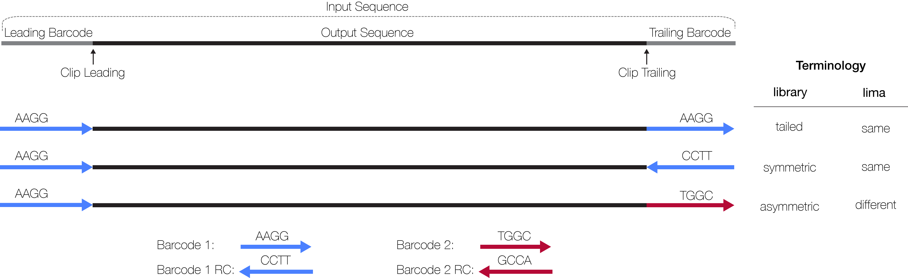
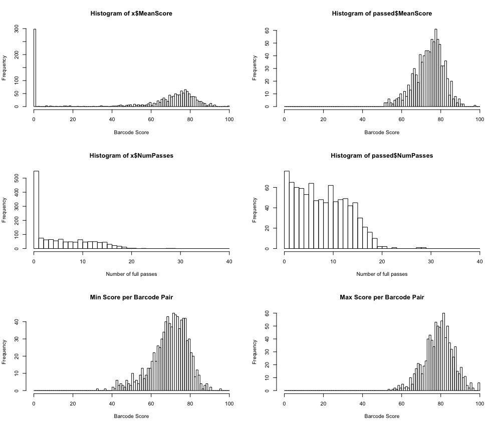

<h1 align="center">
    lima - PacBio Barcode Demultiplexer
</h1>

  

## TOC
* [Scope](#scope)
* [Terminology](#terminology)
* [Workflow](#workflow)
* [Barcode score](#barcode-score)
* [Defaults](#defaults)
* [Missing Features](#missing-features)
* [FAQ](#faq)

## Scope
*Lima* offers following features:
 * Demultiplex PacBio reads with insane speed
 * Both, raw subreads and ccs reads can be processed
 * In- and output are BAM
 * Reports that allow QC
 * Barcode sequences get clipped and `bq` and `bc` tags added, just like bam2bam
 * Barcodes do not necessarily have to be in the correct direction
 * Output can be split by barcode
 * No scraps.bam needed

## Execution
Run on raw subread data:

    lima movie.subreads.bam barcodes.fasta

Run on CCS data:

    lima --css movie.ccs.bam barcodes.fasta

## Terminology

## Workflow

*Lima* processes input reads grouped by ZMW, except if `--per-read` is chosen.
Each target barcode region, leading and treailing, is processed individually.
We refer to a leading and a trailing barcode as a barcode pair.
For a particular target barcode region, every barcode sequence gets
aligned as given and as reverse-complement, best matching is chosen,
and per barcode scores are summed across reads for each ZMW;
the best scoring barcode per target region is chosen using the score sums.

This procedure corresponds to the *asymmetric* library prep, where all possible
combinations are being tested.
If only same barcode pairs are of interest, *symmetric* / *tailed*, please use
`--same` to filter out *different* barcode pairs.

## Output
*Lima* generates four output files, all starting with the BAM input
file name prefix.

### BAM
The first file `prefix.demux.bam` contains clipped records, annotated with
barcode tags, that passed filters and respects `--same`.

### Report
Second file is `prefix.demux.report`, a tsv file about each read, unfiltered.
An individual score with `-1` indicates that a leading or trailing adapter is
missing. This is irrelevant for CCS reads.

    $ head prefix.demux.report | column -t
    ZMW      IdxLeading  IdxTrailing  MeanScoreLeading  MeanScoreTrailing  MeanScore  ClipsLeading    ClipsTrailing          ScoresLeading  ScoresTrailing     NumPasses PassedFilters
    4391559  2           2            73                100                87         0,14,15,14      1558,2097,2183,2113    -1,56,82,82    100,100,100,-1     2         1
    4457329  2           2            65                85                 75         0,15,18         2772,2174,2402         -1,54,76       87,82,-1           1         1
    4522785  3           3            86                87                 87         0,15,15,14      2016,2176,2198,2119    -1,100,76,82   73,100,89,-1       2         1

### Summary
Third file is `prefix.demux.summary`, shows how many ZMWs have been filtered,
how ZMWs many are *same*/*different*, and how many reads have been filtered.

    ZMWs input                    : 332254
    ZMWs above all thresholds (A) : 246998
    ZMWs below any threshold  (B) : 85256

    Marginals for (B)
    ZMWs below length threshold   : 43729
    ZMWs below score threshold    : 41904
    ZMWs below passes threshold   : 85005

    For (A)
    ZMWs w/ same barcode          : 229735
    ZMWs w/ different barcodes    : 17263

    For (A)
    Reads above length            : 2348276
    Reads below length            : 3719

### Counts
Fourth file is `prefix.demux.counts`, a tsv file, shows the counts for each
observed barcode pair; only those barcode that passed filters are counted.
Example:

    $ column -t prefix.demux.counts
    IdxLeading  IdxTrailing  Counts
    0           0            99
    1           1            110
    2           2            124
    3           3            122

## Barcode score
The barcode score is computed by a Smith-Waterman algorithm. The dynamic-programming
matrix has the barcode on the vertical and the target sequence on the horizontal axis.
The best score is determined by chosing the maximum in the last row, which is
also the clipping position.
Afterwards, the barcode score is normalized:

    (100 * sw_score) / (sw_match_score * barcode_length)

The range is between 0 and 100, whereas 0 is no hit and 100 perfect match.
The provided mean score is the mean of both normalizated barcode scores.

## Defaults
 - `--min-length`: Reads with length below 50 bp after demultiplexing are omitted.
 - `--min-score`: ZMWs with barcode score below 45 are omitted.
 - `--min-passes`: ZMWs with less than 1 full pass, a read with a left and right adapter,
   are omitted.
 - `--window-size-mult`: For each barcode, we align it to a subsequence of the begin and end of
   the read. The length of the subsequence is `barcode_length * multiplier`.
 - Alignment options

        -A,--match-score        Score for a sequence match.
        -B,--mismatch-penalty   Penalty for a mismatch.
        -D,--deletion-penalty   Deletions penalty.
        -I,--insertion-penalty  Insertion penalty.
        -X,--branch-penalty     Branch penalty.

## Missing Features
 * bam2bam-like BAM barcode header line

## FAQ
### Why *lima* and not bam2bam?
*Lima* has been born out of the need for a better user experience. Both use the
identical core alignment step, but usability has been improved.

### How fast is fast?
Example: 200 barcodes, asymmetric mode (try each barcode forward and
reverse-complement), 300,000 CCS reads. On my 2014 iMac with 4 cores + HT:

    503.57s user 11.74s system 725% cpu 1:11.01 total

Those 1:11 minutes translate into 0.233 milliseconds per ZMW,
1.16 microseconds per barcode for both sides aligning forward and reverse-complement,
and 291 nanoseconds per alignment. This includes IO.

### Is there a way to show the progress?
No. Please run `wc -l prefix.demux.report` to get the number of processed ZMWs.

### How can I easily plot the score or num-pass distributions?
Use `R`. Example:

    r = read.table("movie.demux.report", header = TRUE)
    par(mfrow=c(3,1))
    passed = x[x$PassedFilters==1,]
    par(mfrow=c(3,2))
    hist(x$MeanScore,breaks=0:100,xlab="Barcode Score")
    hist(passed$MeanScore,breaks=0:100,xlab="Barcode Score")
    hist(x$NumPasses,breaks=0:40,xlab="Number of full passes")
    hist(passed$NumPasses,breaks=0:40,xlab="Number of full passes")
    hist(apply(cbind(passed$MeanScoreLeading,passed$MeanScoreTrailing),1,min),breaks=0:100,main="Min Score per Barcode Pair",xlab="Barcode Score")
    hist(apply(cbind(passed$MeanScoreLeading,passed$MeanScoreTrailing),1,max),breaks=0:100,main="Max Score per Barcode Pair",xlab="Barcode Score")

### Can I split my data by barcode?
You can either iterate over the `prefix.demux.bam` file N times or use
`--split-bam`. Each barcode has its own BAM file called
`prefix.idxLeading-idxTrailing.demux.bam`, e.g., `prefix.0-0.demux.bam`.
This mode consumes more memory, as output cannot be streamed.

### Why are different barcode pair hits reported in --same mode?
*Lima* tries all barcode combinations and `--same` only filters BAM output.
Sequences flanked by *different* barcodes are still reported, but are not
written to BAM. By not enforcing only *same* barcode pairs, *lima* gains
higher PPV, as your sample might be contaminated and contains unwanted
barcode pairs; instead of enforcing one *same* pair, *lima* rather
filters such sequences. Every *symmetric* / *tailed* library contains few *asymmetric*
templates. If many *different* templates are called, your library preparation
might be bad.

### Why are *same* barcode pair hits reported in the default different mode?
Even if your sample is labeled *asymmetric*, *same* hits are simply
sequences flanked by the same barcode ID.

### How do barcode indices correspond to the input sequences?
Input barcode sequences are tagged with an incrementing counter. The first
sequence is barcode `0` and the last barcode `numBarcodes - 1`.

### I used the tailed library prep, what options to choose?
Use `--same`.

### What is different to bam2bam?
 * CCS read support
 * Barcodes of every adapter gets scored for raw subreads
 * Do not enforce symmetric barcode pairing, which increases PPV
 * For asymmetric barcodes, `lima` reports the identified order, instead of
   ascending sorting
 * Call barcodes per read and not per adapter
 * Open-source and can be compiled on your local Mac or Linux machine
 * Nice reports for QC